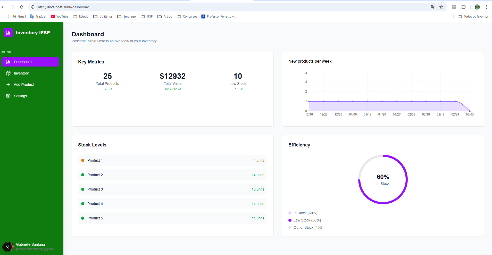
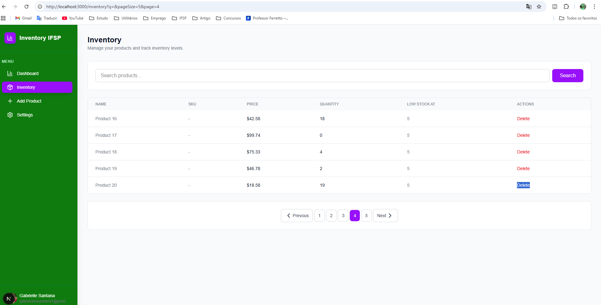

# Inventory Management System

This project is a FullStack Inventory Management Website built with **Next.js 16**.

It was developed as a practical exercise to apply the knowledge and technologies learned at **IFSP** (São Paulo Federal Institute).

## Getting Started

First, run the development server:

```bash
npm run dev
```

Data base using prisma and postgresql.
neon and stack auth

Open [http://localhost:3000](http://localhost:3000) with your browser to see the result.

Tela de dashboard:

Tela de inventário: