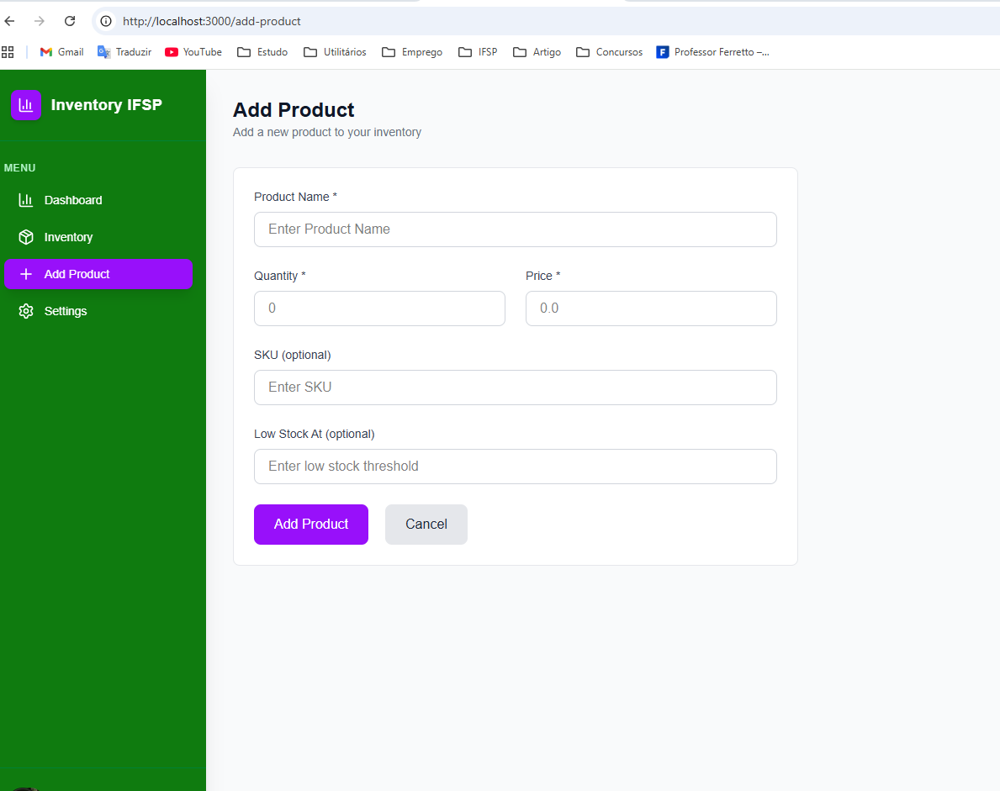
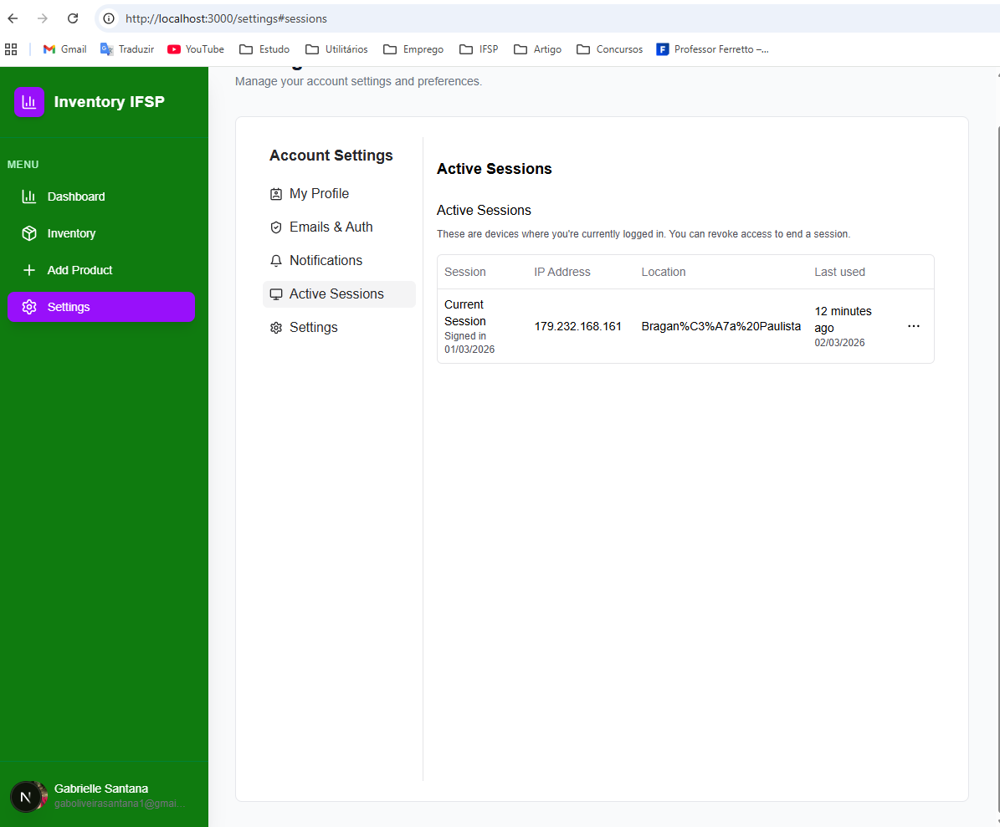
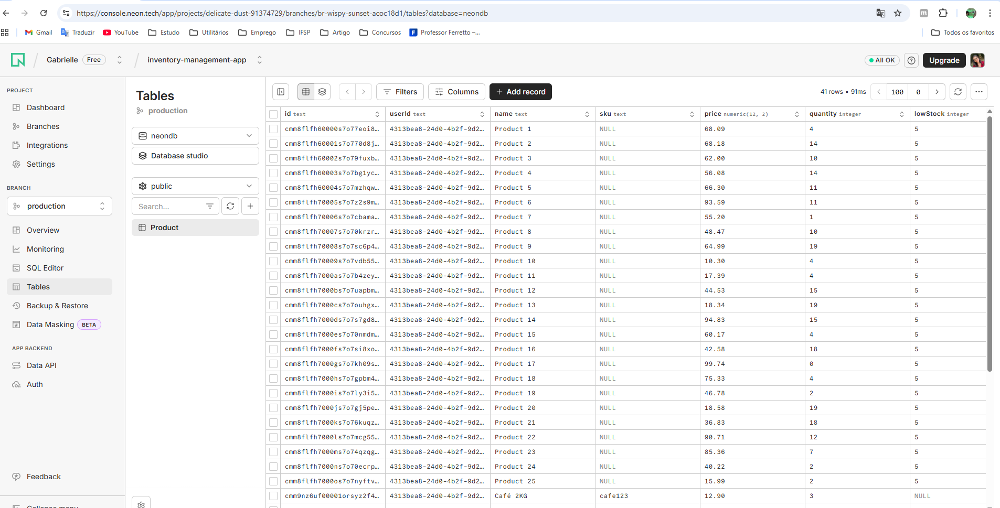
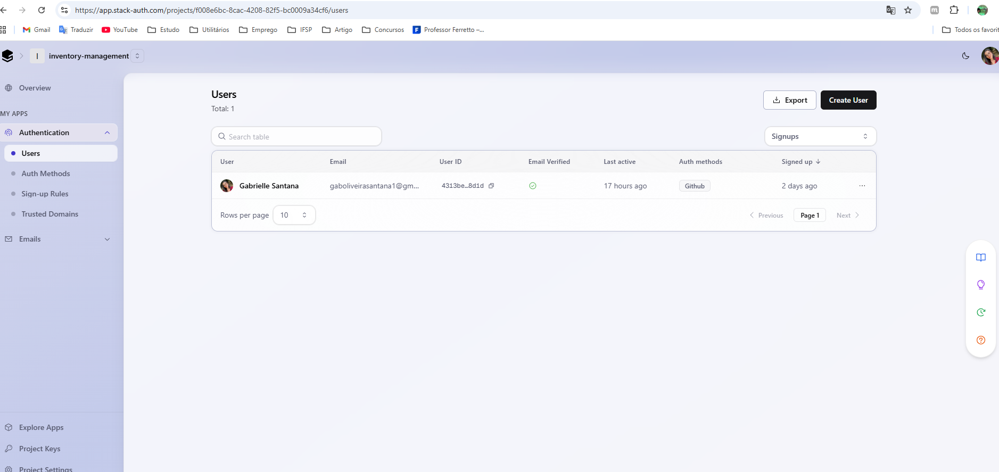

# 📦 FullStack Inventory Management System

A comprehensive FullStack Inventory Management website built with **Next.js 16**, designed as a practical application of the knowledge and technologies learned at **IFSP** (São Paulo Federal Institute).

## 🚀 Technologies Used

This project leverages a modern tech stack to ensure performance, scalability, and security:

- **Framework:** [Next.js 16](https://nextjs.org/)
- **Database ORM:** [Prisma](https://www.prisma.io/)
- **Database Hosting:** [PostgreSQL](https://www.postgresql.org/) via [Neon](https://neon.tech/)
- **Authentication:** [Stack Auth](https://stackauth.com/)

## 🛠️ Getting Started

### Prerequisites
Ensure your environment variables (Database URL and Auth keys) are configured correctly before running the application.

### Run the Development Server
Start the local Next.js server:

```bash
npm run dev
```

Open [http://localhost:3000](http://localhost:3000) with your browser to see the result.

## 📸 Functionalities & Screenshots

The system offers a dashboard to visualize data, manage items, adjust settings, and add new products seamlessly.

### 📊 Dashboard
Overview of your inventory status and key metrics.


### 📋 Inventory
Detailed view of all items currently in stock.


### ➕ Add Product
Quickly insert new products into the database.



### ⚙️ Settings
Manage your user and application preferences.



---

### Infrastructure Integrations

**🐘 Neon Console (Database):**



**🔐 Stack Auth Console (Authentication):**

